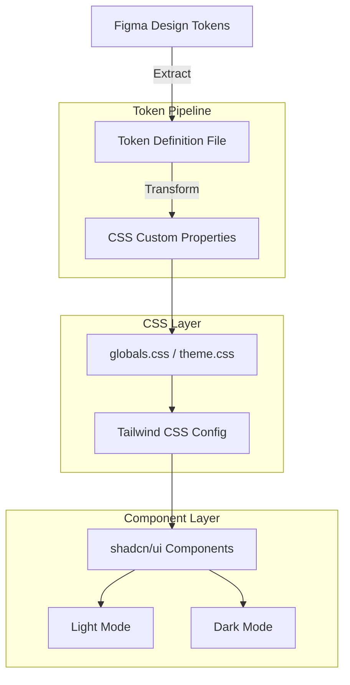
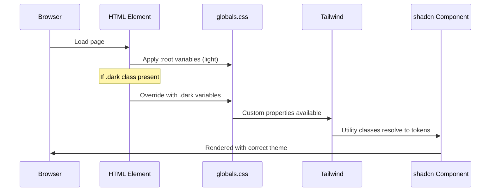
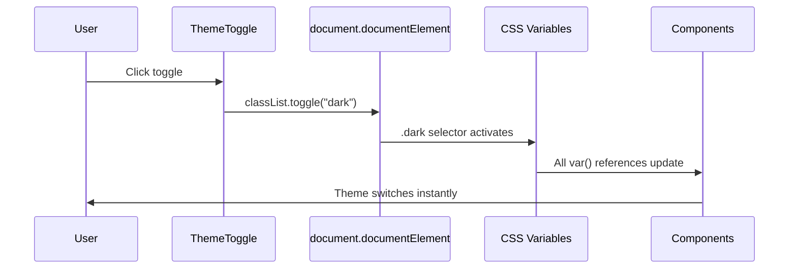

# Design Document: OUI-SCN-DS (OUI Theme)

## Overview

This spec covers the technical implementation of an OpenSearch-branded shadcn/Tailwind CSS design system. The system maps Figma design tokens (colors, typography, spacing, radii, shadows) to CSS custom properties consumed by shadcn/ui components via Tailwind CSS v4.

The implementation produces a single CSS theme file that defines all tokens as custom properties on `:root` (light) and `.dark` (dark) selectors, a Tailwind config extension for custom values, and font setup for Inter/Inter Mono. All shadcn/ui components will automatically inherit the OUI brand through these tokens without per-component overrides.

The primary color is sky-700 (`#0369a1`) for actions and interactive elements in light mode, shifting to sky-600 (`#0284c7`) in dark mode for better contrast. Dark mode uses neutral-950 (`#0a0a0a`) as the background with neutral-900/800 surfaces, and alpha-based white borders for transparency. The type system uses Inter (sans) and Inter Mono (mono) with a standard modular scale from 12px to 36px.

## Architecture



## Sequence Diagrams

### Theme Resolution Flow



### Dark Mode Toggle Flow



## Components and Interfaces

### Component 1: Theme CSS File (`globals.css`)

**Purpose**: Defines all CSS custom properties for light and dark modes. This is the single source of truth for the design system tokens at runtime.

**Interface**:
```css
/* Light mode (default) */
:root {
  --background: <hsl>;
  --foreground: <hsl>;
  --primary: <hsl>;
  /* ... all semantic tokens */
}

/* Dark mode override */
.dark {
  --background: <hsl>;
  --foreground: <hsl>;
  --primary: <hsl>;
  /* ... all semantic tokens */
}
```

**Responsibilities**:
- Define all color tokens as HSL values for shadcn compatibility
- Provide light and dark mode variants
- Define radius, font-family, and shadow custom properties
- Serve as the bridge between Figma tokens and Tailwind utilities

### Component 2: Tailwind Configuration

**Purpose**: Extends Tailwind's default theme to consume the CSS custom properties, making tokens available as utility classes.

**Interface**:
```typescript
// tailwind.config.ts or CSS @theme directive (Tailwind v4)
interface TailwindThemeExtension {
  colors: Record<string, string>   // Maps to var(--token)
  borderRadius: Record<string, string>
  fontFamily: Record<string, string[]>
  boxShadow: Record<string, string>
}
```

**Responsibilities**:
- Map CSS custom properties to Tailwind utility classes
- Extend (not replace) default Tailwind theme
- Ensure `bg-primary`, `text-muted-foreground`, etc. resolve correctly
- Register custom font families

### Component 3: Font Setup

**Purpose**: Load and register Inter and Inter Mono fonts.

**Interface**:
```typescript
// next/font or @font-face declarations
interface FontSetup {
  sans: FontFamily  // Inter
  mono: FontFamily  // Inter Mono
}
```

**Responsibilities**:
- Load Inter (sans) with weights 300–700
- Load Inter Mono with appropriate weights
- Set CSS variables `--font-sans` and `--font-mono`
- Apply font-family to `body` element

## Data Models

### Token Schema

```typescript
/** Hex color converted to HSL for shadcn compatibility */
type HSLString = `${number} ${number}% ${number}%`

interface ColorToken {
  name: string           // e.g. "primary"
  lightValue: HSLString  // HSL for :root
  darkValue: HSLString   // HSL for .dark
  purpose: string        // Documentation
}

interface RadiusToken {
  name: string    // e.g. "lg"
  value: string   // e.g. "0.375rem"
}

interface ShadowToken {
  name: string    // e.g. "sm"
  value: string   // Full CSS shadow string
}

interface DesignTokenSet {
  colors: ColorToken[]
  radii: RadiusToken[]
  shadows: ShadowToken[]
  fonts: { sans: string; mono: string }
  spacing: Record<string, string>
}
```

**Validation Rules**:
- All color values must be valid HSL strings (no hex in CSS custom properties)
- Radius values must use `rem` units
- Every light-mode token must have a corresponding dark-mode token
- Font families must include system fallbacks


## Key Functions with Formal Specifications

### Function 1: hexToHSL()

```typescript
function hexToHSL(hex: string): HSLString
```

**Preconditions:**
- `hex` is a valid 6-digit hex color string (with or without `#` prefix)
- `hex` matches pattern `/^#?[0-9a-fA-F]{6}$/`

**Postconditions:**
- Returns a string in format `"H S% L%"` where H ∈ [0, 360), S ∈ [0, 100], L ∈ [0, 100]
- The returned HSL value is perceptually equivalent to the input hex
- No `hsl()` wrapper — bare values only (shadcn convention)

**Loop Invariants:** N/A

### Function 2: generateCSSVariables()

```typescript
function generateCSSVariables(
  tokens: DesignTokenSet,
  mode: "light" | "dark"
): string
```

**Preconditions:**
- `tokens` contains at least all required shadcn semantic color tokens (background, foreground, primary, secondary, muted, accent, border, input, card, destructive, ring)
- `mode` is either "light" or "dark"
- All color values in tokens are valid HSL strings

**Postconditions:**
- Returns a valid CSS block string containing custom property declarations
- Each property is prefixed with `--` (e.g., `--primary: 199 89% 32%`)
- Light mode returns `:root { ... }` block
- Dark mode returns `.dark { ... }` block
- All tokens from input are represented in output
- Output is valid CSS that can be parsed by any browser

**Loop Invariants:**
- For each token processed: output contains exactly one `--{name}: {value}` declaration

### Function 3: buildTailwindTheme()

```typescript
function buildTailwindTheme(tokens: DesignTokenSet): TailwindThemeExtension
```

**Preconditions:**
- `tokens` is a complete, validated DesignTokenSet
- All color tokens have both light and dark values defined

**Postconditions:**
- Returns object where each color key maps to `hsl(var(--{name}))` or `var(--{name})`
- borderRadius entries use rem values
- fontFamily entries include system fallback stacks
- All shadcn-required keys are present (background, foreground, primary, secondary, muted, accent, destructive, border, input, ring, card, popover)

**Loop Invariants:** N/A

## Algorithmic Pseudocode

### Token-to-CSS Pipeline

```typescript
// Main build pipeline
function buildThemeCSS(figmaTokens: FigmaExport): string {
  // Step 1: Convert hex colors to HSL
  const hslTokens = figmaTokens.colors.map(token => ({
    ...token,
    lightValue: hexToHSL(token.lightHex),
    darkValue: hexToHSL(token.darkHex),
  }))

  // Step 2: Generate CSS blocks
  const lightCSS = generateCSSVariables(hslTokens, "light")
  const darkCSS = generateCSSVariables(hslTokens, "dark")

  // Step 3: Generate non-color tokens (radius, shadows, fonts)
  const radiusCSS = figmaTokens.radii
    .map(r => `  --radius-${r.name}: ${pxToRem(r.value)};`)
    .join("\n")

  const fontCSS = [
    `  --font-sans: "Inter", system-ui, sans-serif;`,
    `  --font-mono: "Inter Mono", ui-monospace, monospace;`,
  ].join("\n")

  // Step 4: Compose final CSS
  return `
@layer base {
  :root {
${lightCSS}
${radiusCSS}
${fontCSS}
  }

  .dark {
${darkCSS}
  }
}
  `.trim()
}
```

### Hex to HSL Conversion

```typescript
function hexToHSL(hex: string): HSLString {
  // Remove # prefix if present
  const clean = hex.replace(/^#/, "")

  // Parse RGB components (0-255 → 0-1)
  const r = parseInt(clean.slice(0, 2), 16) / 255
  const g = parseInt(clean.slice(2, 4), 16) / 255
  const b = parseInt(clean.slice(4, 6), 16) / 255

  const max = Math.max(r, g, b)
  const min = Math.min(r, g, b)
  const delta = max - min

  // Lightness
  const l = (max + min) / 2

  // Saturation
  const s = delta === 0 ? 0 : delta / (1 - Math.abs(2 * l - 1))

  // Hue
  let h = 0
  if (delta !== 0) {
    if (max === r) h = ((g - b) / delta) % 6
    else if (max === g) h = (b - r) / delta + 2
    else h = (r - g) / delta + 4
    h = Math.round(h * 60)
    if (h < 0) h += 360
  }

  return `${h} ${Math.round(s * 100)}% ${Math.round(l * 100)}%`
}
```

## Example Usage

### globals.css Output

```css
@layer base {
  :root {
    --background: 0 0% 100%;
    --foreground: 0 0% 4%;
    --card: 0 0% 100%;
    --card-foreground: 0 0% 4%;
    --primary: 199 89% 32%;
    --primary-foreground: 0 0% 98%;
    --secondary: 0 0% 96%;
    --secondary-foreground: 0 0% 9%;
    --muted: 0 0% 96%;
    --muted-foreground: 0 0% 45%;
    --accent: 204 94% 94%;
    --accent-foreground: 0 0% 9%;
    --border: 0 0% 83%;
    --input: 0 0% 90%;
    --ring: 199 89% 32%;
    --destructive: 0 84% 60%;
    --destructive-foreground: 0 0% 98%;

    --radius: 0.375rem;
    --radius-md: 0.25rem;
    --radius-lg: 0.375rem;
    --radius-xl: 0.5rem;
    --radius-2xl: 1rem;

    --font-sans: "Inter", system-ui, sans-serif;
    --font-mono: "Inter Mono", ui-monospace, monospace;

    --shadow-xs: 0 1px 2px 0 rgba(0,0,0,0.05);
    --shadow-sm: 0 1px 2px -1px rgba(0,0,0,0.1), 0 1px 3px 0 rgba(0,0,0,0.1);
    --shadow-lg: 0 4px 6px -4px rgba(0,0,0,0.1), 0 10px 15px -3px rgba(0,0,0,0.1);
  }

  .dark {
    --background: 0 0% 4%;
    --foreground: 0 0% 98%;
    --card: 0 0% 9%;
    --card-foreground: 0 0% 98%;
    --primary: 199 89% 39%;
    --primary-foreground: 0 0% 9%;
    --secondary: 0 0% 15%;
    --secondary-foreground: 0 0% 98%;
    --muted: 0 0% 15%;
    --muted-foreground: 0 0% 64%;
    --accent: 204 82% 24%;
    --accent-foreground: 0 0% 98%;
    --border: 0 0% 100% / 0.2;
    --input: 0 0% 100% / 0.15;
    --ring: 199 89% 39%;
    --destructive: 0 63% 31%;
    --destructive-foreground: 0 0% 98%;

    --shadow-xs: none;
    --shadow-sm: none;
    --shadow-lg: 0 4px 6px -4px rgba(0,0,0,0.3), 0 10px 15px -3px rgba(0,0,0,0.3);
  }
}
```

### Tailwind Config Integration (v4 CSS-first)

```css
/* Using Tailwind v4 @theme directive */
@theme {
  --color-background: hsl(var(--background));
  --color-foreground: hsl(var(--foreground));
  --color-primary: hsl(var(--primary));
  --color-primary-foreground: hsl(var(--primary-foreground));
  --color-secondary: hsl(var(--secondary));
  --color-secondary-foreground: hsl(var(--secondary-foreground));
  --color-muted: hsl(var(--muted));
  --color-muted-foreground: hsl(var(--muted-foreground));
  --color-accent: hsl(var(--accent));
  --color-accent-foreground: hsl(var(--accent-foreground));
  --color-border: hsl(var(--border));
  --color-input: hsl(var(--input));
  --color-ring: hsl(var(--ring));
  --color-destructive: hsl(var(--destructive));
  --color-destructive-foreground: hsl(var(--destructive-foreground));
  --color-card: hsl(var(--card));
  --color-card-foreground: hsl(var(--card-foreground));

  --font-sans: "Inter", system-ui, sans-serif;
  --font-mono: "Inter Mono", ui-monospace, monospace;

  --radius-md: 0.25rem;
  --radius-lg: 0.375rem;
  --radius-xl: 0.5rem;
  --radius-2xl: 1rem;
}
```

### Component Usage

```tsx
import { Button } from "@/components/ui/button"
import { Card, CardContent, CardHeader, CardTitle } from "@/components/ui/card"

// Components automatically use theme tokens — no overrides needed
function DashboardCard() {
  return (
    <Card>
      <CardHeader>
        <CardTitle className="text-xl font-semibold">
          Active Users
        </CardTitle>
      </CardHeader>
      <CardContent>
        <p className="text-3xl font-bold">2,847</p>
        <p className="text-sm text-muted-foreground">+12% from last month</p>
        <Button className="mt-4">View Details</Button>
      </CardContent>
    </Card>
  )
}
```

## Correctness Properties

*A property is a characteristic or behavior that should hold true across all valid executions of a system — essentially, a formal statement about what the system should do. Properties serve as the bridge between human-readable specifications and machine-verifiable correctness guarantees.*

### Property 1: HSL Format Validity

*For any* valid 6-digit hex color string (with or without `#` prefix), `hexToHSL()` shall return a string matching the pattern `H S% L%` where H ∈ [0, 360), S ∈ [0, 100], L ∈ [0, 100], with no `hsl()` wrapper.

**Validates: Requirements 1.1, 1.3**

### Property 2: Hex Prefix Equivalence

*For any* valid 6-digit hex color string, `hexToHSL("#" + hex)` shall produce the same result as `hexToHSL(hex)`.

**Validates: Requirement 1.2**

### Property 3: Hex-to-HSL Round Trip

*For any* valid 6-digit hex color string, converting to HSL via `hexToHSL()` and back to hex via `hslToHex()` shall produce a color within ΔE < 1 of the original.

**Validates: Requirement 1.5**

### Property 4: Invalid Hex Rejection

*For any* string that does not match the pattern `/^#?[0-9a-fA-F]{6}$/`, `hexToHSL()` shall throw a descriptive error.

**Validates: Requirement 1.4**

### Property 5: CSS Selector Wrapping by Mode

*For any* valid DesignTokenSet and mode ("light" or "dark"), `generateCSSVariables()` shall return a CSS block wrapped in `:root { ... }` for light mode or `.dark { ... }` for dark mode, containing all token declarations.

**Validates: Requirements 2.1, 2.2**

### Property 6: One Declaration Per Token

*For any* valid DesignTokenSet, the output of `generateCSSVariables()` shall contain exactly one `--{name}: {value}` declaration per token in the input set.

**Validates: Requirement 2.3**

### Property 7: Valid CSS Output

*For any* valid DesignTokenSet, the output of `generateCSSVariables()` shall be syntactically valid CSS parseable by a standard CSS parser.

**Validates: Requirement 2.4**

### Property 8: Tailwind Color Mapping Format

*For any* valid DesignTokenSet, each color entry in the output of `buildTailwindTheme()` shall match the format `hsl(var(--{name}))`.

**Validates: Requirement 3.1**

### Property 9: Tailwind Required Keys Completeness

*For any* valid DesignTokenSet containing all shadcn required tokens, the output of `buildTailwindTheme()` shall include all shadcn_Required_Tokens as color keys.

**Validates: Requirement 3.2**

### Property 10: Tailwind Radius Rem Format

*For any* valid DesignTokenSet with radius tokens, the border-radius entries in the output of `buildTailwindTheme()` shall use rem values.

**Validates: Requirement 3.3**

### Property 11: Light/Dark Token Parity

*For any* generated theme CSS, every token name defined in the `:root` selector shall also be defined in the `.dark` selector, and vice versa.

**Validates: Requirements 5.4, 8.2, 8.3**

### Property 12: Missing Token Validation

*For any* DesignTokenSet that is missing one or more shadcn_Required_Tokens, the Token_Pipeline shall halt and report an error message that lists every missing token name.

**Validates: Requirements 2.5, 8.1, 8.4**

### Property 13: Dark Mode Toggle Round Trip

*For any* set of CSS custom properties, toggling dark mode on and then off shall restore all computed style values to their original light-mode values.

**Validates: Requirement 6.4**

### Property 14: WCAG AA Contrast Compliance

*For any* foreground/background token pair defined in the theme (in both light and dark modes), the contrast ratio shall be at least 4.5:1 for normal text and at least 3:1 for large text and UI components.

**Validates: Requirements 10.1, 10.2, 10.3**


## Error Handling

### Error Scenario 1: Invalid Hex Color Input

**Condition**: A Figma token contains a malformed hex value (e.g., `#GGG`, 3-digit shorthand, or empty string).
**Response**: `hexToHSL()` throws a descriptive error identifying the token name and invalid value.
**Recovery**: Build pipeline halts with actionable error message. Developer fixes the token source.

### Error Scenario 2: Missing Required Token

**Condition**: The Figma export is missing a token required by shadcn (e.g., `destructive` or `ring`).
**Response**: `generateCSSVariables()` validates completeness before output and reports missing tokens.
**Recovery**: Developer adds missing tokens to the Figma file or provides manual overrides in a fallback config.

### Error Scenario 3: Font Loading Failure

**Condition**: Inter font files fail to load (CDN down, self-hosted files missing).
**Response**: CSS `font-family` fallback chain activates: `system-ui, sans-serif`.
**Recovery**: No user-visible breakage. Monitoring alerts on font load failure rate.

### Error Scenario 4: Dark Mode Token Mismatch

**Condition**: A token exists in `:root` but not in `.dark` (or vice versa).
**Response**: Build-time validation script flags the mismatch.
**Recovery**: Developer adds the missing token definition before deployment.

## Testing Strategy

### Unit Testing Approach

- Test `hexToHSL()` with known hex→HSL pairs (e.g., `#0369a1` → `199 89% 32%`).
- Test `generateCSSVariables()` output contains all required tokens.
- Test that output CSS is syntactically valid (parseable by PostCSS).
- Test edge cases: black (`#000000`), white (`#ffffff`), pure red/green/blue.

### Property-Based Testing Approach

**Property Test Library**: fast-check

- For any valid 6-digit hex string, `hexToHSL()` returns a string matching `\d+ \d+% \d+%`.
- For any `DesignTokenSet`, `generateCSSVariables()` output contains exactly one declaration per token.
- Round-trip: `hslToHex(hexToHSL(hex))` produces a color within ΔE < 1 of the original.

### Integration Testing Approach

- Render a shadcn Button component and verify computed `background-color` matches `--primary` HSL value.
- Toggle `.dark` class and verify all computed colors change to dark-mode values.
- Verify WCAG AA contrast ratios for all foreground/background pairs using automated tooling.
- Visual regression tests comparing rendered components against Figma screenshots.

## Performance Considerations

- CSS custom properties are resolved at paint time — no JS runtime cost for theming.
- Font loading: Use `font-display: swap` to prevent FOIT (Flash of Invisible Text).
- Preload Inter font files with `<link rel="preload">` for critical weights (400, 500, 600).
- Dark mode toggle is pure CSS class swap — no re-render of React component tree.
- Total CSS theme file should be < 2KB gzipped.

## Security Considerations

- Font files should be self-hosted or loaded from a trusted CDN with SRI (Subresource Integrity) hashes.
- CSS custom properties cannot execute scripts — no XSS vector from token values.
- Dark mode preference stored in `localStorage` — no sensitive data involved.
- Ensure no user-supplied values are interpolated into CSS custom property names.

## Dependencies

| Dependency | Purpose | Version |
|---|---|---|
| `tailwindcss` | Utility-first CSS framework | v4.x |
| `shadcn/ui` | Component library consuming theme tokens | Latest |
| `@fontsource/inter` | Font package (Inter + Inter Mono) | Latest |
| `next` | Next.js App Router (`devIndicators: false` in next.config) | v15.x |
| `next-themes` | Dark mode toggle (if using Next.js) | Latest |
| `postcss` | CSS processing pipeline | Latest |
| `fast-check` | Property-based testing | Latest |
